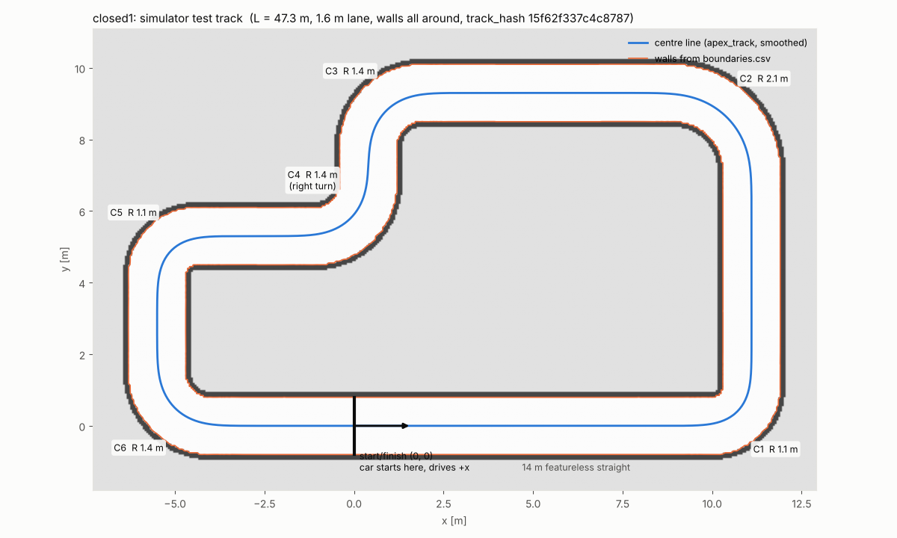

# closed1 — simulator test track

`closed1` is a **simulator-only** test track, not our real track.

- 47.3 m loop with a 1.6 m lane and walls all around (no side corridors).
- Six corners: R 1.1 / 2.2 / 1.5 / 1.5 (right turn) / 1.1 / 1.5 m. These are design radii; the smoothed centre line gives 1.1 / 2.1 / 1.4 / 1.4 / 1.1 / 1.4 m.
- A 14 m featureless start straight. Start/finish is at (0, 0), 4 m into that straight, driving +x.
- Hashes: track_hash `15f62f337c4c8787`, boundary_hash `2e17a89df3452c0e`.



| File | What it is |
|---|---|
| `make_closed_track.py` | The generator: straights plus circular arcs; two straight lengths are solved so the loop closes exactly. |
| `closed1.png`, `closed1.yaml` | The ROS map (5 cm cells): the lane is free (254), a 15 cm wall band is occupied (0), and everything behind it is UNKNOWN (205). |
| `plot_track.py`, `closed1_track.png` | The figure: the map, the apex_track centre line, and the walls from `../boundaries.csv`. |

## Why thin walls with unknown behind, not solid black

The first version painted everything outside the lane black, and AMCL got lost in every run: it jumped into the island and the EKF ended up 10–20 m off.

AMCL's likelihood-field model scores each laser point by its distance to the nearest occupied pixel. Inside a solid black block every point is at distance zero, so a wrong pose there scores as a perfect match. A SLAM map looks like this one: thin walls with unknown space behind them.

**Real car:** never "clean up" a SLAM map by painting the inside or outside of the track black.

## How to drive it in the simulator

1. Copy the map: `mkdir -p ~/apex_maps/closed1 && cp closed1.png closed1.yaml ~/apex_maps/closed1/`
2. Make a simulator config: copy f1tenth_gym_ros' `config/sim.yaml` to `~/apex_maps/closed1/sim_closed1.yaml` and change only these values:
   - `map_path: /home/<you>/apex_maps/closed1/closed1` (no extension)
   - `map_img_ext: '.png'`
   - `sx: 0.0`, `sy: 0.0`, `stheta: 0.0`
3. Launch the simulator with `config:=/home/<you>/apex_maps/closed1/sim_closed1.yaml`. `gym_bridge_launch.py` accepts this argument; our runner passes it through `lidar_perception sim_perception.launch.py`.
4. Run localization and evaluation on closed1:

   ```bash
   ros2 launch state_estimation sim_eval.launch.py track:=closed1 \
       waypoints:=$(ros2 pkg prefix apex_track)/share/apex_track/tracks/closed1/centerline.csv
   ```

   `track` selects the apex_track track used by state_estimate and eval_logger, and `waypoints` sets the test_driver's path. Both default to Levine.

## How to rebuild it (only after an intended change)

Run this from the `apex_track` folder:

```bash
python3 tracks/closed1/sim/make_closed_track.py tracks/closed1/sim       # map + closed1_centerline.csv
cp tracks/closed1/sim/closed1_centerline.csv tracks/closed1/centerline.csv
python3 -m apex_track.boundaries tracks/closed1/track.yaml --map tracks/closed1/sim/closed1.yaml
python3 -m apex_track.vectors tracks/closed1/track.yaml
```

Any geometry change gives a new track_hash and boundary_hash, so tell planning and control.

## What it showed (2026-10-06, run K)

This track was built to test one idea: that Levine's corner errors came from its open corners, where side corridors join. It disproved that idea, because the closed corners still had errors.

The real cause was a half-cell map offset in nav2 AMCL:
- nav2 AMCL puts the centre of map cell i at `origin + i·res`.
- ROS (map_server, RViz, the simulator, apex_track) puts it at `origin + (i + ½)·res`.
- So AMCL's pose comes out shifted by half a cell, 2.5 cm in −x and −y on a 5 cm map.

`state_estimation`'s ekf_node corrects this with the parameter `amcl_offset_m`.
